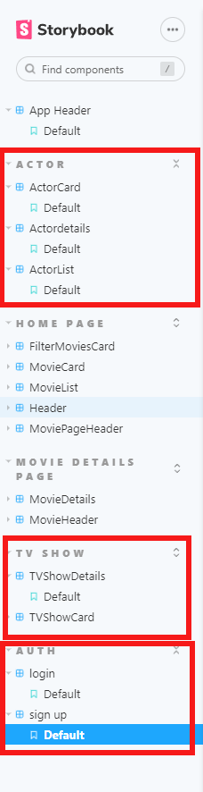
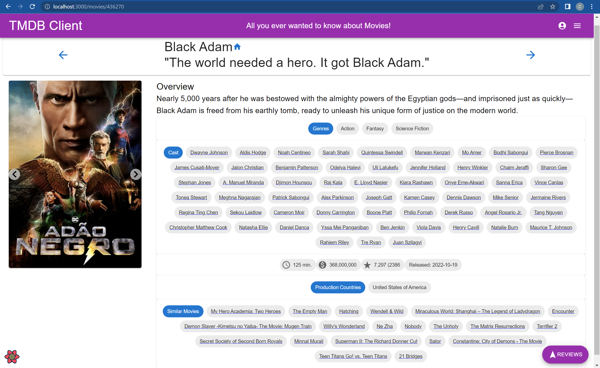
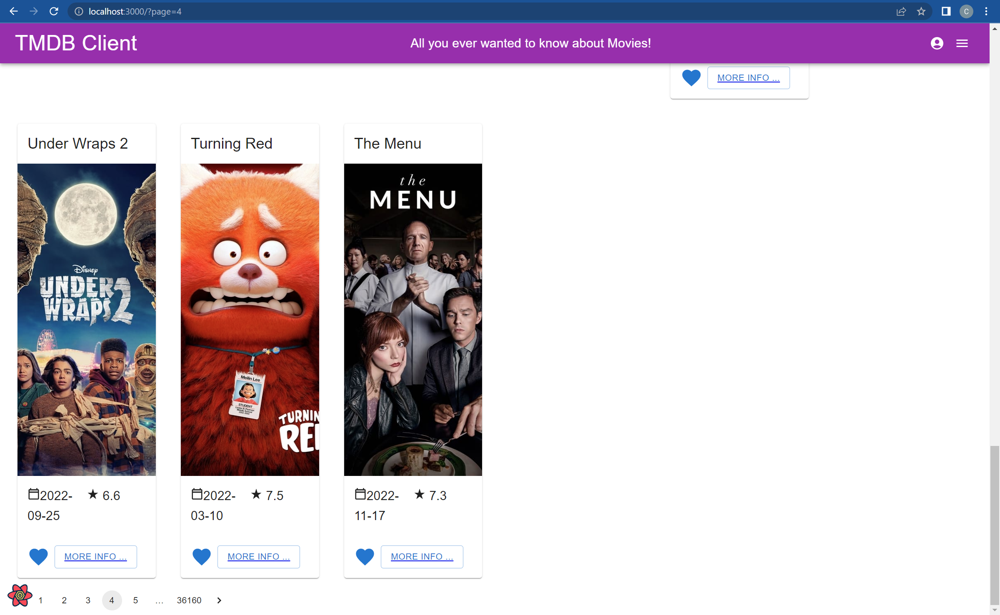

# Web App Dev 2 - Assignment 1 - ReactJS app.

Name: Corey Shanahan

## Overview.

### New Pages.

- Login page
- Sign up page
- (modified) Home page - added pagination
- Top rated movies page
- Discover Tv show page
- Popular Actors page
- Favoutite Tv shows page
- Watch Later page

- (modified) Movie details page - added image slideshow, added cast chips, added simliar movies chips
- Tv show details page
- Actors details page

### New Features.

- Authentication (using Firebase)
- Create a fantasy movie (Basic)
- Pagination on movies, actors and tv shows

## Setup requirements.

None

## TMDB endpoints.

### Movies

- /movie/{movie_id}/similar - A list of similar movies.
- /movie/{movie_id}/credits - the cast & crew of the movie
- /movie/top_rated - the current top rated movies

### Actors

- /person/popular - A list of popular actors.
- /person/{person_id} - gets the details of an actor
- /person/{person_id}/movie_credits - list of movies an actor has starred in
- /person/{person_id}/tv_credits - list of tv shows the actor has starred in
- /person/{person_id}/images - list of images of an actor

### Tv shows

- /tv/popular - The current popular tv shows.
- /tv/{tv_id} - Gets the details of a show
- /tv/{tv_id}/credits - gets the cast & crew of a tv show
- /tv/{tv_id}/images - the images related to a show

## App Design.

### Component catalogue.

### UI Design.

[ Insert screenshots of the **new app pages** you developed (including modified existing pages), Have an appropriate caption for each one (see example below).

> Shows detailed information on a movie. The movie posters are now in a slideshow. The name's of the cast are links to their details page. Similar movies are also links to their details page.

> Shows the 4th page in the popular movies page.

### Routing.

[ List the __new routes__ supported by your app and state the associated page.]

e.g.

- /actors - displays a list of popular actors.
- /actors/:id - shows details about a particular actor.
- /actors/:id/movies (protected) - an actor's movie credits.
- etc.

[If relevant, state what aspects of your app are protected/private (i.e. require authentication) and what is public.]

## Independent learning (If relevant).

[ Itemize the technologies/techniques you researched independently and adopted in your project, i.e. aspects not covered in the lectures/labs. Mention the source code filenames that illustrate these (code excerpts are not required) and provide references to the online resources that helped you (articles/blogs).
